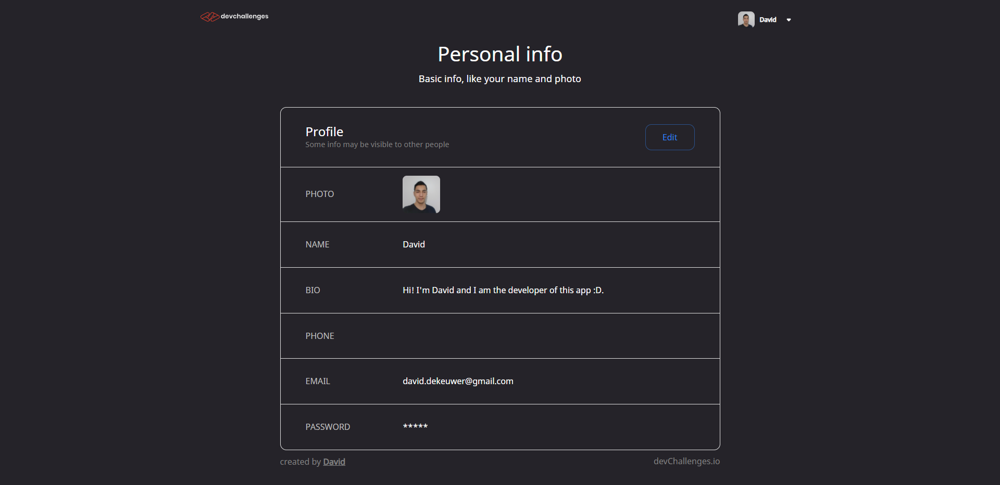

<!-- Please update value in the {}  -->

<h1 align="center">Authentication App - Front-end</h1>

<div align="center">
   Solution for a challenge from  <a href="http://devchallenges.io" target="_blank">Devchallenges.io</a>.
</div>

<div align="center">
  <h3>
    <a href="https://authentication-app-woad.vercel.app/">
      Demo
    </a>
    <span> | </span>
    <a href="https://devchallenges.io/solutions/nM7HeFb3gII4lGBkSBt2">
      Solution
    </a>
    <span> | </span>
    <a href="https://devchallenges.io/challenges/N1fvBjQfhlkctmwj1tnw">
      Challenge
    </a>
  </h3>
</div>

<!-- TABLE OF CONTENTS -->

## Table of Contents

- [Overview](#overview)
  - [Built With](#built-with)
- [Features](#features)
- [How to use](#how-to-use)
- [Contact](#contact)
- [Acknowledgements](#acknowledgements)

<!-- OVERVIEW -->

## Overview



- Where can I see your demo? Right here :D : https://authentication-app-woad.vercel.app/
- What was your experience?  
  Awesome simple app that learns you many things about security, input validation, and sessions! I really struggled to put the front-end and back-end together, being a full-stack dev is exhausting xD. My mistake here was that I was trying to do both at the SAME time. My mind was going crazy by switching between the front-end and back-end. I don't recommend doing that for efficiency. I should've first written down the endpoints, the models, then start front-end or back-end first.
- What have you learned/improved?  
I learned the concept of Next.js, the server side rendering, the caching and so on. I learned the Material UI styling system, and used some components that I found really useful.
- Your wisdom? :)

### Built With

<!-- This section should list any major frameworks that you built your project using. Here are a few examples.-->

- [React](https://reactjs.org/)
- [Next](https://nextjs.org/)
- [Material UI](https://mui.com/)

## Features

<!-- List the features of your application or follow the template. Don't share the figma file here :) -->

This application/site was created as a submission to a [DevChallenges](https://devchallenges.io/challenges) challenge. The [challenge](https://devchallenges.io/challenges/N1fvBjQfhlkctmwj1tnw) was to build an application to complete the given user storie.
* User story: I can register a new account
* User story: I can log in
* User story: I can log in or register with at least one of the following services: Google, Facebook, Twitter or Github
* User story: I can sign out
* User story: I can see my profile details
* User story: I can edit my details including: photo, name, bio, phone, email and password
* User story: I can upload a new photo or provide an image URL

## How To Use

<!-- Example: -->

To clone and run this application, you'll need [Git](https://git-scm.com) and [Node.js](https://nodejs.org/en/download/) (which comes with [npm](http://npmjs.com)) installed on your computer. From your command line:

Then to start the Next app:
```bash
# Clone this repository
$ git clone https://github.com/david-dkp/AuthenticationApp.git

# Install dependencies
$ npm install

# Run the app
$ npm run dev
```
After cloning, you'll need to create a '.env.local' file, in which you'll put the following key:
```
NEXT_PUBLIC_SERVER_URL=http://localhost:8000
```

You will also need to start the server, which you can clone the project here: https://github.com/david-dkp/AuthenticationApp-Server 

## Contact

- Website [dekeuwerdavid.fr](https://dekeuwerdavid.fr)
- GitHub [@david-dkp](https://github.com/david-dkp)
- LinkedIn [David Dekeuwer](https://www.linkedin.com/in/david-dekeuwer-1940a01b9/)

## More
You can check my back-end here too :D : https://github.com/david-dkp/AuthenticationApp-Server